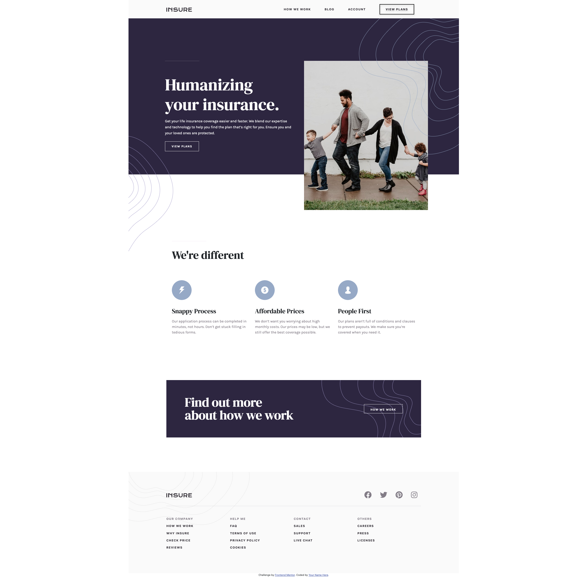

# Frontend Mentor - Insure landing page solution

This is a solution to the [Insure landing page challenge on Frontend Mentor](https://www.frontendmentor.io/challenges/insure-landing-page-uTU68JV8). Frontend Mentor challenges help you improve your coding skills by building realistic projects.

## Table of contents

-   [Overview](#overview)
    -   [The challenge](#the-challenge)
    -   [Screenshot](#screenshot)
    -   [Links](#links)
-   [My process](#my-process)
    -   [Built with](#built-with)
    -   [What I learned](#what-i-learned)
    -   [Continued development](#continued-development)
-   [Author](#author)

## Overview

### The challenge

Users should be able to:

-   View the optimal layout for the site depending on their device's screen size
-   See hover states for all interactive elements on the page

### Screenshot



### Links

-   Solution URL: [Add solution URL here](https://github.com/charlesmiller0412/insureLanding)
-   Live Site URL: [Add live site URL here](https://charlesmiller0412.github.io/insureLanding/)

## My process

### Built with

-   Semantic HTML5 markup
-   CSS custom properties
-   Mobile-first workflow
-   Bootstrap
-   jQuery

### What I learned

While this project was fairly straightforward and nearly 100% design based, it was fun to add a mobile menu with some helpers in jQuery as well as relearn :nth-of-type.

```css
#nav__desktop-links a:nth-of-type(4) {
    border: 2px solid black;
    padding: 13px 25px;
    filter: drop-shadow(0px 4px 4px rgba(0, 0, 0, 0.25));
}
```

```js
$(".menuIcon").click(function () {
    console.log("worked");
    // $("#menu").toggle();
    if (this.id == "menuOpen") {
        $("#menu").slideDown();
        $("#menuOpen").css("display", "none");
        $("#menuClose").css("display", "block");
    } else {
        $("#menu").slideUp();
        $("#menuClose").css("display", "none");
        $("#menuOpen").css("display", "block");
    }
});
```

### Continued development

I would like to continue future projects with emphasis on mobile-first design.

## Author

-   Website - [Charles Miller](https://www.charlesmiller.dev)
-   Frontend Mentor - [@charlesmiller0412](https://www.frontendmentor.io/profile/charlesmiller0412)
